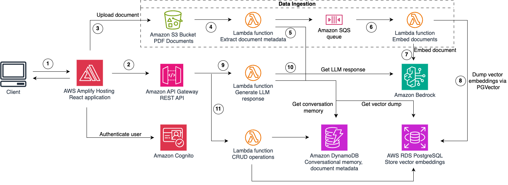

# Life Cycle Chat 

The LCI prototype solution is an automated pipeline that uses a large language model (LLM) to validate LCI data and the underlying assumptions.

| Index                                               | Description                                             |
| :-------------------------------------------------- | :------------------------------------------------------ |
| [High Level Architecture](#high-level-architecture) | High level overview illustrating component interactions |
| [Deployment](#deployment-guide)                     | How to deploy the project                               |
| [User Guide](#user-guide)                           | The working solution                                    |
| [Directories](#directories)                          | General project directory structure
| [Changelog](#changelog)                             | Any changes post publish                                |
| [Credits](#credits)                                 | Meet the team behind the solution                       |
| [License](#license)                                 | License details                                         |

## High-Level Architecture

The following architecture diagram illustrates the various AWS components utilized to deliver the solution. For an in-depth explanation of the frontend and backend stacks, please look at the [Architecture Deep Dive](docs/ArchitectureDeepDive.md).



## Deployment Guide

To deploy this solution, please follow the steps laid out in the [Deployment Guide](docs/DeploymentGuide.md)

## User Guide

Please refer to the [Web App User Guide](docs/UserGuide.md) for instructions on navigating the web app interface.

## Directories

```
├── backend
│   ├── bin
│   ├── layers
│   ├── lib
│   └── src
├── docs
└── frontend
    ├── public
    └── src
        ├── common
        ├── components
        └── routes
```

1. `/backend`: Contains the deployment code for the app's AWS infrastructure
    - `/bin`: Contains the instantiation of CDK stack
    - `/layers`: Contains the required layers for lambda functions
    - `/lib`: Contains the deployment code for all infrastructure stacks
    - `/src`: Contains lambda functions
2. `/docs`: Contains documentation for the application
3. `/frontend`: Contains the user interface of the application
    - `/public`: public assets used in the application
    - `/src/common`: Contains shared components used in the application
    - `/src/components`: Contains components used in the application
    - `/src/routes`: Contains pages comprising the application's interface

## Changelog
N/A

## Credits

This application was architected and developed by David Mwita and Arshia Moghimi. Thanks to the UBC Cloud Innovation Centre Technical and Project Management teams for their guidance and support.

## License

This project is distributed under the [MIT License](LICENSE).
