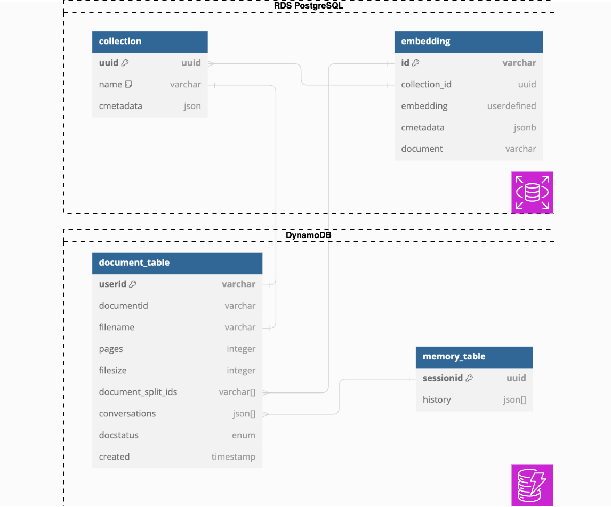

# Architecture Deep Dive

## Architecture


## Description
1. The user sends a request to the application hosted on AWS Amplify.
2. Amplify integrates with the backend API Gateway.
3. Users can upload files to the application, which are stored in an S3 bucket using a pre-signed upload URL.
4. Adding a new file to the S3 bucket triggers the data ingestion workflow, with a lambda function extracting the metadata (the number of pages in the document and its size).
5. The lambda function updates the Documents table in DynamoDB with the document's data and pushes a queue in Amazon SQS.
6. Another lambda function picks the message from the queue and processes the document, splitting it into multiple documents
7. The embeddings lambda generates the vector embeddings using Amazon Bedrock embedding models
8. The lambda function stores the vectors in the PostgreSQL database.
9. After the document is successfully processed, users can start chatting with it by sending an API request that invokes the lambda function to generate a response.
10. This lambda function uses RAG architecture to retrieve the response from LLMs hosted on Amazon Bedrock augmented with the documents' information stored in the vector database.
11. The application also supports reading the list of documents and their metadata and deleting them.

## Database Schema



### RDS PostgreSQL Tables
### `collection` table

| Column Name | Description 
| ----------- | ----------- 
| uuid | The uuid of the collection
| name | The name of the collection
| cmetadata | The metadata of the collection 

### `embedding` table

| Column Name | Description 
| ----------- | ----------- 
| id | The ID of the embeddings
| collection_id | The uuid of the collection
| embedding |  The vector embeddings of the document
| cmetadata | The metadata of the collection
| document | The content of the document


### DynamoDB Tables
### `document_table` table

| Column Name | Description 
| ----------- | ----------- 
| userid | The ID of the user uploading the document
| documentid | The id of the document
| filename | The name of the document
| pages | Number of pages in the document 
| filesize | The size of the document
| document_split_ids| The embedding IDs of the document
| conversations | The list of conversations with the document 
| docstatus | The processing status of the document
| created | The time the document was processed 

### `memory_table` table

| Column Name | Description 
| ----------- | ----------- 
| session_id | The uuid of the chat session
| history | The list of the messages in the chat session


## S3 Structure

```
.
├── user1/
│   └── document1.pdf
└── user2/
    ├── document1.pdf
    └── document2.pdf

```