# Deployment Guide

**Please ensure the application is deployed, instructions in the deployment guide here:**
- [Deployment Guide](./deploymentGuide.md)

Once you have deployed the solution, the following user guide will help you navigate the functions available.

| Index    | Description |
| -------- | ------- |
| [Creating Users](#creating-users)  | How to create user profiles |
| [Requesting Model Access](#requesting-model-access)  | How to request model access |
| [Using the Application](#using-the-application)  | How to use the application |

## Creating Users
To create a user, open the AWS Console and do the following:

1. Navigate to AWS Cognito

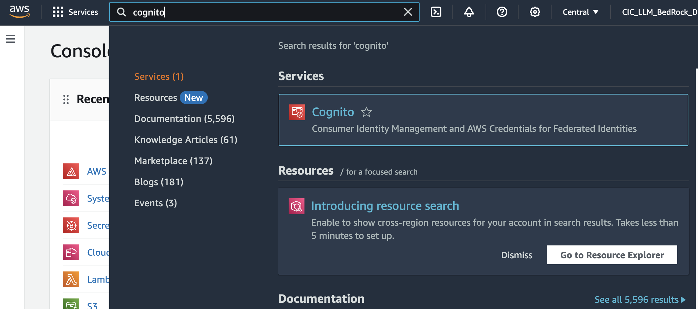

2. Open `User Pools`

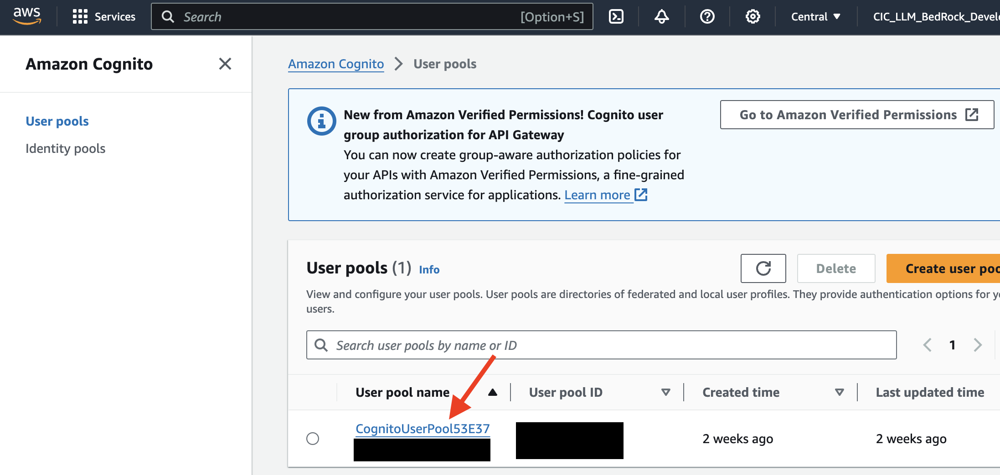

3. Click `Create User]`

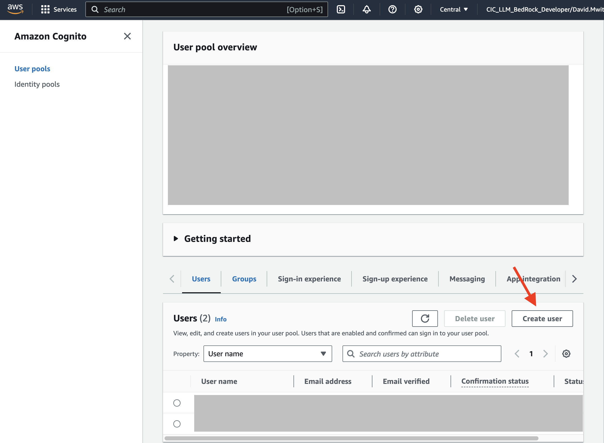

4. Fill the user form as marked

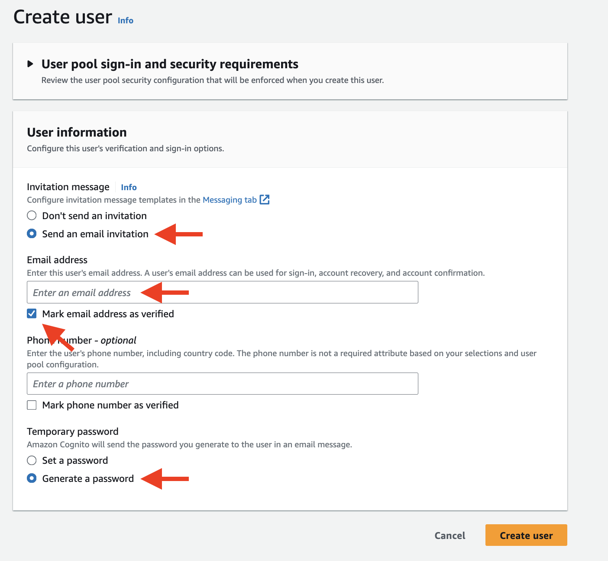

5. Click `Create User`

The user should now be created. You can now login into the application.

## Requesting Model Access
To request model access:

1. Navigate to Amazon Bedrock

2. On the left panel, select `Model Access` under `Bedrock Configurations`

3. Request access to the Embedding and LLM models you specified in the [deployment stack](../backend/lib/document-chat.ts)

For instance:
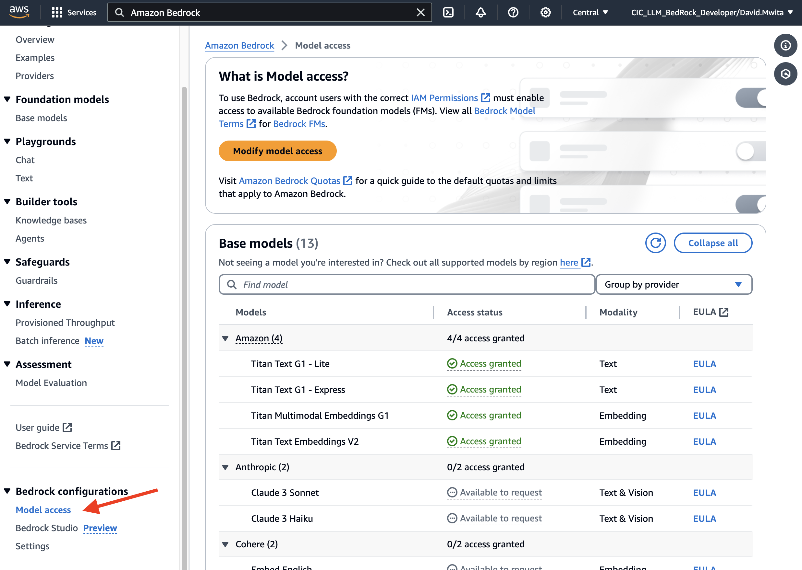

Model access should be granted immediately. You can now begin using the application.

## Using the Application

1. Sign in

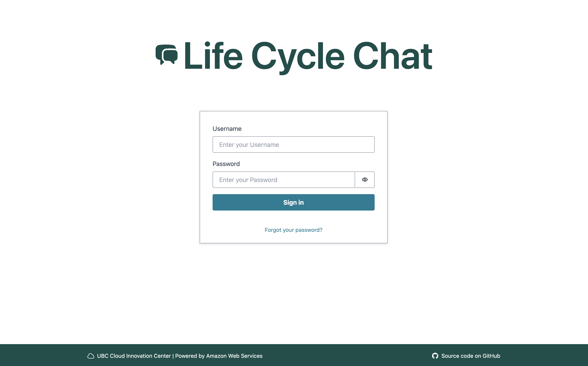

2. Upload a document

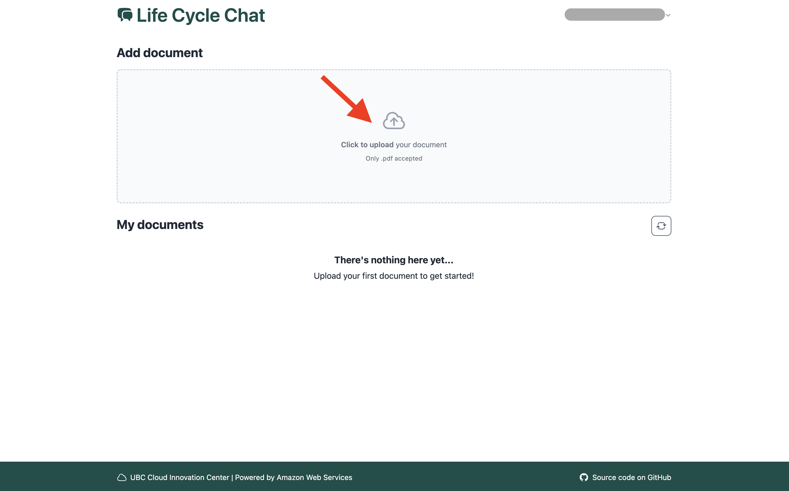

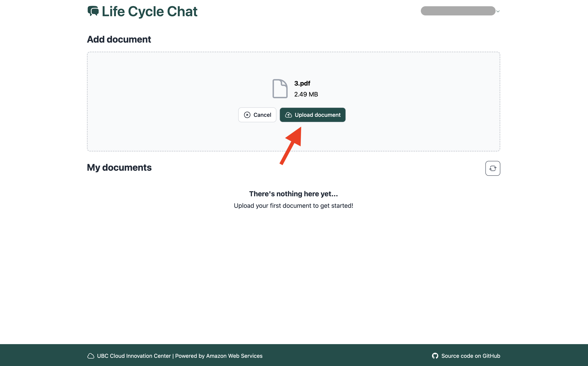

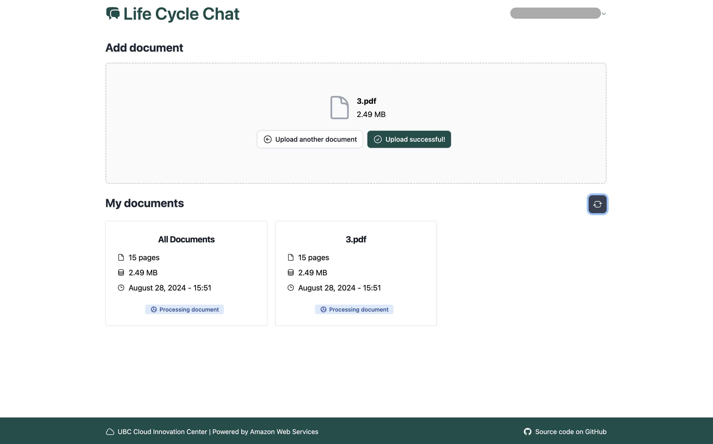

3. Click on any document (or `All Documents`) to chat with it

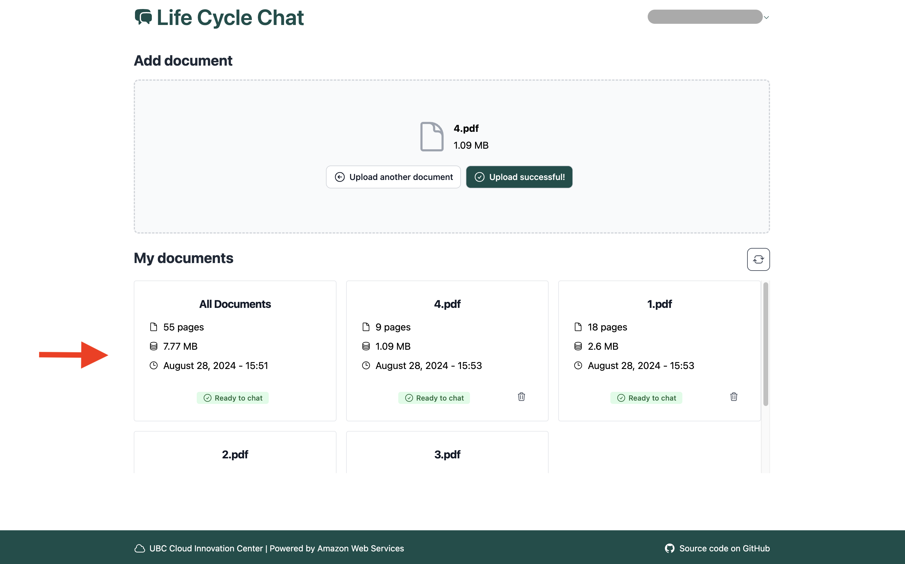

4. Start a conversation and chat with the document

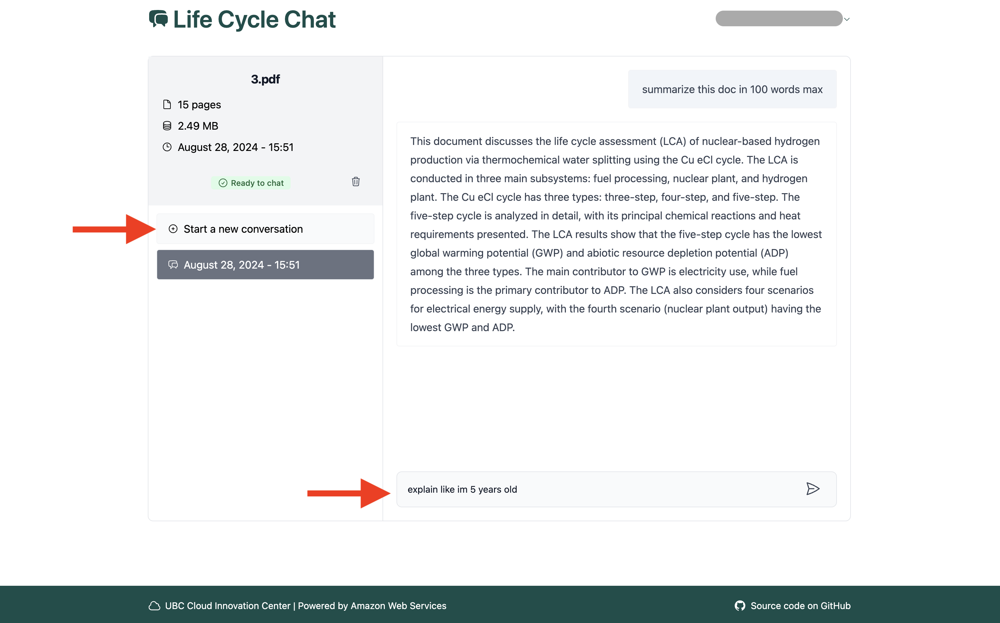

5. Sign out

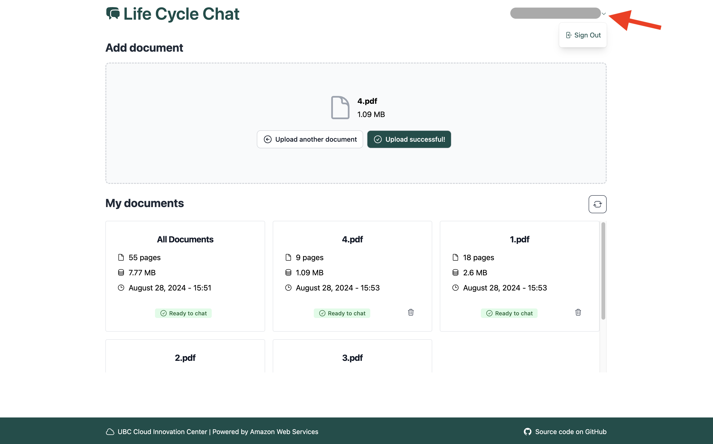

